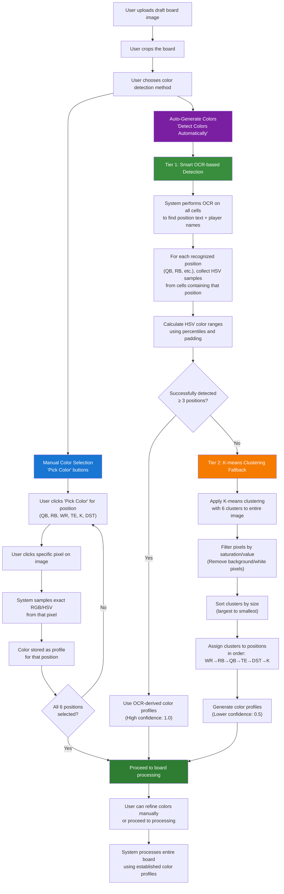

# Color Detection Process Flowchart

## Process Overview

This flowchart shows the two-tier color detection system:

### Manual Color Selection (Blue Path)
- Direct pixel sampling by user interaction
- Full user control over color selection
- No algorithmic processing involved

### Auto-Generate Colors (Purple Path)
- **Tier 1 (Green)**: Smart OCR-based detection using actual draft board content
- **Tier 2 (Orange)**: K-means clustering fallback when OCR fails
- Graceful degradation ensures system always works

### Key Features
- High confidence (1.0) for OCR-derived profiles
- Lower confidence (0.5) for K-means fallback
- Users can always refine auto-detected colors manually
