# Complete End-to-End Draft Board OCR Workflow

```mermaid
flowchart TD
    A["Final Player Results<br/>(from Advanced Prediction)"] --> B["Results Processing & Output Generation"]
    
    B --> B1["Organize Results by Grid Position"]
    B1 --> B2["Generate Multiple Output Formats"]
    
    B2 --> B2a["CSV Export<br/>(board.csv)"]
    B2 --> B2b["JSON Export<br/>(board.json)"]
    B2 --> B2c["Row-Major Text<br/>(rows.txt)"]
    B2 --> B2d["Column-Major Text<br/>(cols.txt)"]
    B2 --> B2e["Low Confidence Review<br/>(review_low_confidence.csv)"]
    B2 --> B2f["Visual Overlay Image<br/>(overlay.png)"]
    
    B2a --> C["Web Interface Display"]
    B2b --> C
    B2c --> C
    B2d --> C
    B2e --> C
    B2f --> C
    
    C --> C1["Grid View Display<br/>(Draft board layout)"]
    C --> C2["Team Roster View<br/>(Organized by teams)"]
    C --> C3["Results Analysis<br/>(Statistics and confidence)"]
    C --> C4["Download Options<br/>(All formats available)"]
    
    C1 --> D["User Review & Validation"]
    C2 --> D
    C3 --> D
    C4 --> D
    
    D --> D1["Interactive Cell Editing<br/>(Manual corrections if needed)"]
    D1 --> D2["Real-time Result Updates"]
    D2 --> D3["Confidence Score Recalculation"]
    D3 --> E["Results Finalization"]
    
    E --> F["ESPN Fantasy Upload Decision"]
    F --> F1{"User wants to<br/>upload to ESPN?"}
    
    F1 -->|No| G1["Manual Export Only<br/>(Download files)"]
    F1 -->|Yes| G2["ESPN Selenium Automation"]
    
    G2 --> G2a["Collect ESPN Credentials"]
    G2a --> G2b["ESPN League URL"]
    G2a --> G2c["Username & Password"]
    G2a --> G2d["Dry Run Mode Selection"]
    
    G2d --> H["Selenium WebDriver Setup"]
    H --> H1["Launch Chrome Browser<br/>(with appropriate options)"]
    H1 --> H2["Navigate to ESPN Fantasy"]
    H2 --> H3["Automated Login Process"]
    
    H3 --> H4["Login Validation"]
    H4 --> H5{"Login successful?"}
    H5 -->|No| H6["Login Error<br/>(Return error to user)"]
    H5 -->|Yes| I["Navigate to Draft Page"]
    
    I --> I1["Find Draft/Team Management Section"]
    I1 --> I2["Organize Results by Team<br/>(Convert grid to team rosters)"]
    
    I2 --> J["Draft Results Processing"]
    J --> J1["Map Players to Teams<br/>(Based on draft position)"]
    J1 --> J2["Handle Special Cases<br/>(DST teams, bye weeks)"]
    J2 --> J3["Validate Team Rosters<br/>(Position requirements)"]
    
    J3 --> K["Upload Mode Decision"]
    K --> K1{"Dry Run Mode<br/>enabled?"}
    
    K1 -->|Yes| K2["Preview Mode"]
    K2 --> K2a["Display Draft Preview"]
    K2a --> K2b["Show Team Rosters"]
    K2b --> K2c["Validate Data Accuracy"]
    K2c --> K2d["Generate Preview Report"]
    K2d --> L1["Return Preview to User"]
    
    K1 -->|No| K3["Live Upload Mode"]
    K3 --> K3a["Navigate to Team Pages"]
    K3a --> K3b["For Each Team: Add Players"]
    K3b --> K3c["Fill Player Search Fields"]
    K3c --> K3d["Select Correct Players"]
    K3d --> K3e["Set Draft Order/Positions"]
    K3e --> K3f["Submit Team Changes"]
    
    K3f --> M["Upload Validation"]
    M --> M1["Verify All Players Added"]
    M1 --> M2["Check for Upload Errors"]
    M2 --> M3{"Upload successful?"}
    
    M3 -->|No| M4["Upload Error Handling"]
    M4 --> M4a["Log Error Details"]
    M4a --> M4b["Attempt Retry (if applicable)"]
    M4b --> M4c["Return Error Report"]
    
    M3 -->|Yes| M5["Upload Success"]
    M5 --> M5a["Generate Success Report"]
    M5a --> M5b["Log Upload Statistics"]
    M5b --> M5c["Cleanup Browser Session"]
    
    L1 --> N["Final Results"]
    M4c --> N
    M5c --> N
    G1 --> N
    H6 --> N
    
    N --> N1["Complete Process Log"]
    N --> N2["Success/Error Status"]
    N --> N3["Generated Files Available"]
    N --> N4["ESPN Upload Status (if attempted)"]
    
    N4 --> O["Workflow Complete"]
    
    style A fill:#2196f3,color:#fff
    style B fill:#4caf50,color:#fff
    style C fill:#ff9800,color:#fff
    style D fill:#9c27b0,color:#fff
    style E fill:#f44336,color:#fff
    style F fill:#795548,color:#fff
    style G2 fill:#607d8b,color:#fff
    style H fill:#3f51b5,color:#fff
    style I fill:#e91e63,color:#fff
    style J fill:#009688,color:#fff
    style K2 fill:#4caf50,color:#fff
    style K3 fill:#ff5722,color:#fff
    style M fill:#673ab7,color:#fff
    style N fill:#1976d2,color:#fff
    style O fill:#2e7d32,color:#fff
```

## Complete End-to-End Workflow

This flowchart shows the complete journey from final player results through ESPN upload:

### 🔵 Results Processing & Output Generation
- **Multiple formats**: CSV, JSON, text files, visual overlays
- **Quality control**: Low confidence review files
- **Visual validation**: Annotated overlay images

### 🟢 Web Interface Display & Interaction
- **Grid view**: Draft board layout with all players
- **Team rosters**: Organized by fantasy teams
- **Interactive editing**: Manual corrections and real-time updates
- **Download options**: All formats available for export

### 🟠 User Review & Validation
- **Cell-level editing**: Click to modify any player assignment
- **Confidence tracking**: Visual indicators for uncertain matches
- **Real-time updates**: Immediate recalculation of results

### 🟣 Results Finalization
- **Data validation**: Ensure all cells have valid assignments
- **Confidence scoring**: Final accuracy assessment
- **Export preparation**: Ready for manual download or ESPN upload

### 🔴 ESPN Upload Decision Point
- **Manual export**: Download files for manual entry
- **Automated upload**: Selenium-based ESPN integration

### 🟤 ESPN Selenium Automation Setup
- **Credential collection**: League URL, username, password
- **Browser automation**: Chrome WebDriver with stealth options
- **Login process**: Automated ESPN authentication

### 🔵 Navigation & Draft Page Access
- **Site navigation**: Find draft/team management sections
- **Page validation**: Ensure correct league and permissions
- **Data organization**: Convert grid results to team rosters

### 🔴 Draft Results Processing
- **Team mapping**: Assign players to correct fantasy teams
- **Special handling**: DST teams, bye weeks, position requirements
- **Roster validation**: Ensure complete and valid team compositions

### 🟢 Preview Mode (Dry Run)
- **Safe testing**: Preview without making changes
- **Data validation**: Verify accuracy before live upload
- **User review**: Generate detailed preview reports

### 🟠 Live Upload Mode
- **Automated entry**: Navigate ESPN interface programmatically
- **Player search**: Find and select correct players
- **Team building**: Construct complete rosters
- **Draft order**: Set proper draft positions and timing

### 🟣 Upload Validation & Error Handling
- **Success verification**: Confirm all players added correctly
- **Error recovery**: Handle failures gracefully
- **Detailed logging**: Complete audit trail of all actions

### 🔵 Final Results & Cleanup
- **Process completion**: Success/error status reporting
- **File availability**: All generated outputs accessible
- **ESPN status**: Upload results and any issues
- **Session cleanup**: Proper browser and resource cleanup

## Key Features

### **Comprehensive Output Generation**
- Multiple file formats for different use cases
- Visual validation with annotated overlay images
- Quality control with low-confidence flagging

### **Interactive Web Interface**
- Real-time editing and validation
- Multiple view modes (grid, teams, analysis)
- Immediate feedback on changes

### **Sophisticated ESPN Integration**
- Selenium-based browser automation
- Dry run mode for safe testing
- Comprehensive error handling and logging
- Support for complex league configurations

### **End-to-End Validation**
- Results validation at every stage
- Interactive correction capabilities
- Complete audit trail and logging
- Graceful error handling throughout

This represents the complete workflow from OCR results to ESPN fantasy league integration!
