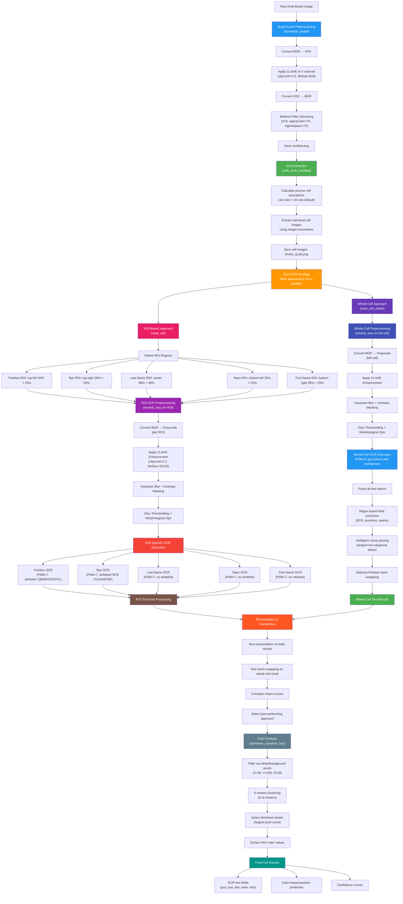

# Image Preprocessing and OCR Pipeline

## Pipeline Overview

This flowchart details the complete image preprocessing and OCR pipeline:

### 🔵 Board-Level Preprocessing
- CLAHE contrast enhancement on HSV V-channel
- Bilateral filtering for noise reduction
- Saves enhanced board as `rectified.png`

### 🟢 Grid Extraction
- Calculates precise cell boundaries (16×10 default)
- Extracts individual cell images with no gaps/overlaps
- Saves cells as `r{row}_c{col}.png`

### 🟠 Dual OCR Strategy
The system runs **both approaches in parallel** for maximum accuracy:

#### 🔴 ROI-Based Approach (read_cell)
- Divides each cell into 5 regions for targeted OCR:
  - **Position**: Top-left corner (35% × 25%)
  - **Bye Week**: Top-right corner (35% × 25%)
  - **Last Name**: Center region (80% × 40%)
  - **Team**: Bottom-left corner (35% × 25%)
  - **First Name**: Bottom-right corner (35% × 25%)
- Each ROI gets individual `neutral_otsu` preprocessing
- Uses PSM=7 with position-specific whitelists
- Parallel processing of all 5 ROIs

#### 🟣 Whole-Cell Approach (read_cell_whole)
- Processes entire cell as single unit
- Single `neutral_otsu` preprocessing on full cell
- Uses PSM=6 to get tokens with confidence scores
- Intelligent parsing using regex and stopword filtering
- Finds longest non-stopword token as last name
- Tests first/last name swapping for better matches

### 🟠 Reconciliation & Competition
- Both approaches run reconciliation against player database
- System tests name swapping on whole-cell results
- Compares match scores between approaches
- **Automatically selects the best performing result**

### 🔵 Color Analysis
- K-means clustering on non-background pixels
- Dominant color extraction for position prediction
- HSV color space analysis

### 🟢 Final Results
- Combined OCR text fields
- Color-based position predictions
- Confidence scoring for validation
