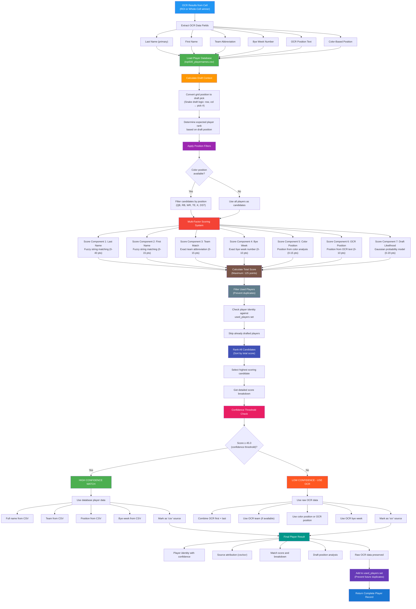

# Player Name Prediction and Reconciliation Process

## Process Overview

This flowchart details the sophisticated player name prediction and reconciliation system:

### 🔵 OCR Input Processing
- Receives winning OCR results from dual-strategy pipeline
- Extracts all available text fields and color-based position

### 🟢 Database Integration
- Loads comprehensive player database (top500_playernames.csv)
- Handles special cases like DST teams and free agents
- Maintains player rankings for draft likelihood calculations

### 🟠 Draft Context Analysis
- Converts grid position to actual draft pick using snake draft logic
- Calculates expected player rank based on draft position
- Provides context for draft likelihood scoring

### 🟣 Intelligent Filtering
- Uses color-based position detection for strong filtering
- Reduces candidate pool to relevant position players
- Maintains full candidate pool when color data unavailable

### 🔴 Multi-Factor Scoring System (7 Components)
1. **Last Name (40%)**: Fuzzy string matching using token_set_ratio
2. **First Name (15%)**: Additional fuzzy matching when available
3. **Team Match (15%)**: Exact team abbreviation matching
4. **Bye Week (10%)**: Exact bye week number matching
5. **Color Position (15%)**: Position from color analysis
6. **OCR Position (10%)**: Position from OCR text recognition
7. **Draft Likelihood (20%)**: Gaussian probability model based on ADP

### 🟤 Duplicate Prevention
- Maintains used_players set with unique player identities
- Prevents same player from being drafted multiple times
- Uses composite identity: (first, last, team, pos, bye)

### 🔵 Ranking and Selection
- Sorts all candidates by total score
- Selects highest scoring available player
- Provides detailed score breakdown for transparency

### 🔴 Confidence-Based Decision
- **High Confidence (≥45 points)**: Use database player data
- **Low Confidence (<45 points)**: Fall back to raw OCR data
- Maintains data quality while handling edge cases

### 🟢 Comprehensive Output
- Complete player record with all metadata
- Source attribution for traceability
- Match confidence and score breakdown
- Draft position analysis and raw OCR preservation

## Key Features

- **Fuzzy Matching**: Handles OCR errors and name variations
- **Draft Intelligence**: Uses ADP rankings and draft position context
- **Multi-Modal Validation**: Combines text, color, and positional data
- **Graceful Degradation**: Falls back to OCR when matching fails
- **Duplicate Prevention**: Sophisticated identity tracking
- **Transparency**: Detailed scoring breakdown for debugging
